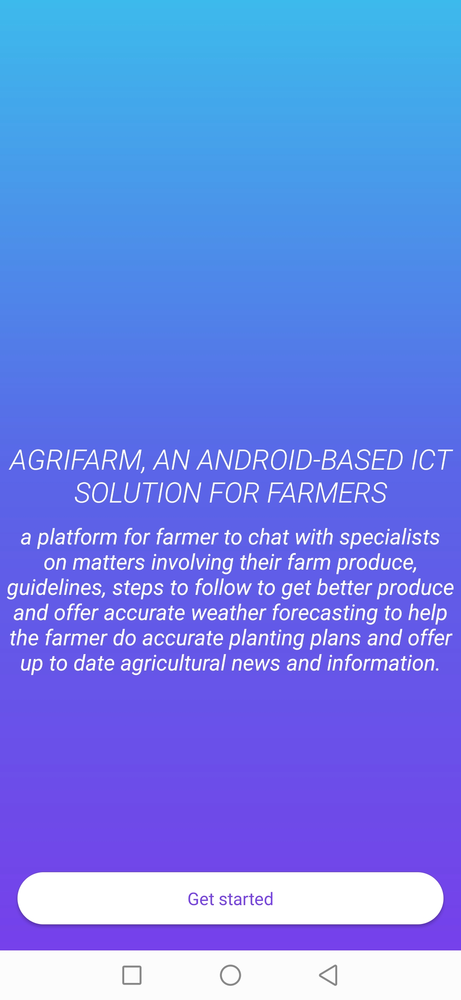
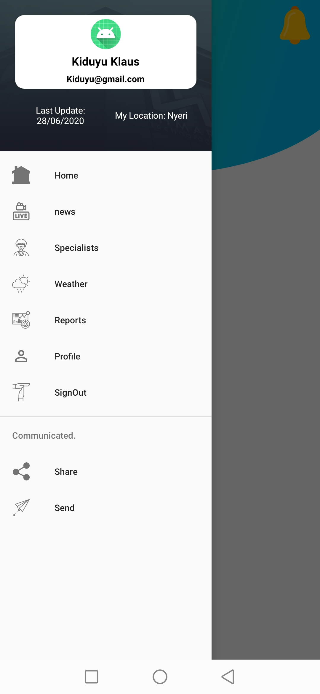

# AgriFarm

  
  
  

 A platform for farmer to chat with specialists on matters involving their farm produce, guidelines, steps to follow to get better produce and offer accurate weather feeds to help the farmer do accurate planting plans and offer up to date agricultural news and information.

  *UNDER DEVELOPMENT*
 ### To-Do List

- [x] Create project
- [x] Design Splash, login and Register
- [x] Create Home Activity and the drawer
- [ ] Provide Weather forecast to farmers to facilitate planning.
- [ ] Develop a platform to connect farmers through a chat forum.
- [ ] Provide a Kenyan-based Agricultural information and news
- [ ] Develop a platform to chat with specialists.

# ScreenShots
   

